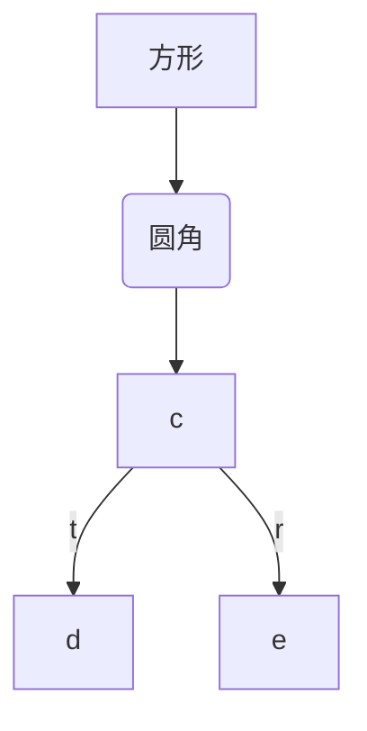

# 一级标题
## 二级标题
### 三级标题
#### 四级标题
```python
print("lee")
```
1. nihao
    - aaa
        - aaa
    - bbb
1.1 ccc
2. nihao
    - nihao
        - nihao
        **222**
        - [x] nihao
        - [ ] mohao


*abc*
1. a
---
1.1 b
1.1.1. c
> avcsss

aaaaaaaaaaaaaa  
aaaaaaaaaaaaaaaaaa
aaaaaaaaaa

~~aaaaaaaaaa[^aacd]
[^aacd]: aaa
> aaa
>> aaa
>>> aaa
>> aa
> aa

>>aaa

aaa

    printt

[aaa](baidu.com)

